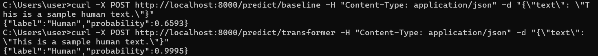

# Is it written by AI

This project provides a FastAPI-based REST API that predicts whether a given text is written by a human or generated by AI. It supports both a traditional machine learning baseline model (Logistic Regression) and a transformer-based model (RoBERTa).

---

## Features

- Dual inference support: Baseline model with logistic regression & Transformer model
- Text classification with probability confidence
- REST API built with FastAPI
- Easy testing via `curl` or Swagger UI

